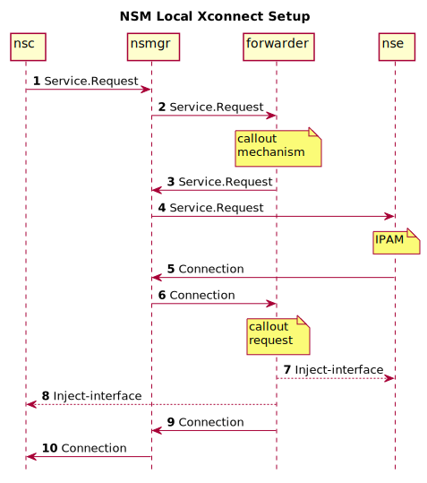
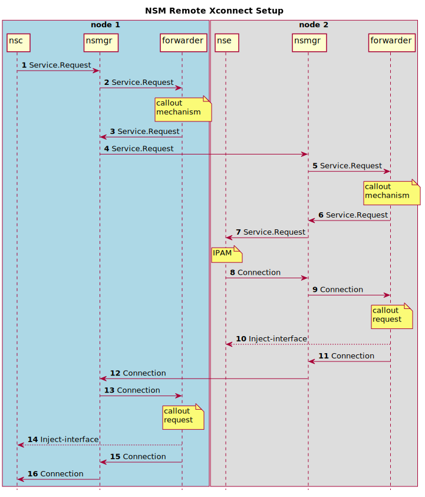

# nsm-forwarder-generic

A generic forwarder for NSM next-gen.

This forwarder was created for educational and experimental
purposes. It makes callouts to a script/program that will do the
necessary network setup. This makes it easy to make a PoC for a new
forwarder before implementing the real thing.

For tests in [xcluster](https://github.com/Nordix/xcluster) please see
[Nordix/nsm-test](https://github.com/Nordix/nsm-test).


## Local

Sequence diagram when the `nsc` and `nse` are on the same node;




Request (narrowed);
```json
{
  "connection": {
    "id": "f8eca5d3-d1d1-4ef2-8616-b2e45951d346",
    "network_service": "icmp-responder",
    "mechanism": {
      "cls": "LOCAL",
      "type": "KERNEL",
      "parameters": {
        "inodeURL": "file:///proc/20/fd/14"
      }
    },
    "context": {
      "ip_context": {
        "src_ip_addr": "169.254.0.1/32",
        "dst_ip_addr": "169.254.0.0/32",
        "src_routes": [
          {
            "prefix": "169.254.0.0/32"
          }
        ],
        "dst_routes": [
          {
            "prefix": "169.254.0.1/32"
          }
        ]
      }
    }
  },
  "mechanism_preferences": [
    {
      "cls": "LOCAL",
      "type": "KERNEL",
      "parameters": {
        "inodeURL": "file:///proc/20/fd/11",
        "name": "nsm-1"
      }
    }
  ]
}
```

The forwarder shall;

* Create two interfaces connected to each other

* Inject one to the nsc and the other to the nse

* Set addresses on the interfaces and add routes

The obvious choice for Linux is a veth pair. The "inodeURL"s are used
to get the netns of the PODs.


## Remote

Sequence diagram when the `nsc` and `nse` are on different nodes;



Communication is setup and interfaces injected by the callout script
in the "request" callout.

Remote request (narrowed);
```json
{
  "connection": {
    "id": "0bb3f086-717a-48b9-87d8-33d95362ffe4",
    "network_service": "icmp-responder",
    "mechanism": {
      "cls": "LOCAL",
      "type": "KERNEL",
      "parameters": {
        "inodeURL": "file:///proc/19/fd/12"
      }
    },
    "context": {
      "ip_context": {
        "src_ip_addr": "169.254.0.1/32",
        "dst_ip_addr": "169.254.0.0/32",
        "src_routes": [
          {
            "prefix": "169.254.0.0/32"
          }
        ],
        "dst_routes": [
          {
            "prefix": "169.254.0.1/32"
          }
        ]
      }
    }
  },
  "mechanism_preferences": [
    {
      "cls": "REMOTE",
      "type": "KERNEL",
      "parameters": {
        "src_ip": "192.168.1.2",
        "vlan": "3877",
        "vni": "1223869"
      }
    }
  ]
}
```

Local request (narrowed);
```json
{
  "connection": {
    "id": "71f46233-821d-4d3c-86f5-059c3f5917d3",
    "network_service": "icmp-responder",
    "mechanism": {
      "cls": "REMOTE",
      "type": "KERNEL",
      "parameters": {
        "dst_ip": "192.168.1.3",
        "src_ip": "192.168.1.2",
        "vlan": "3877",
        "vni": "1223869"
      }
    },
    "context": {
      "ip_context": {
        "src_ip_addr": "169.254.0.1/32",
        "dst_ip_addr": "169.254.0.0/32",
        "src_routes": [
          {
            "prefix": "169.254.0.0/32"
          }
        ],
        "dst_routes": [
          {
            "prefix": "169.254.0.1/32"
          }
        ]
      }
    },
  "mechanism_preferences": [
    {
      "cls": "LOCAL",
      "type": "KERNEL",
      "parameters": {
        "inodeURL": "file:///proc/21/fd/11",
        "name": "nsm-1"
      }
    }
  ]
}
```

The `machanism` is always "KERNEL" since NSM must be updated if other
types like "VLAN" or "OVS" shall be supported. The callout script adds
the ip of the "other" nsmgr and random values for "vlan" and "vni".

**NOTE** there is a chance that vlan or vni will collide, but hey,
  this for experiments only.


## Build image

```
./build.sh image
# Upload to xcluster local registry if needed
images lreg_upload --strip-host registry.nordix.org/cloud-native/nsm/forwarder-generic:latest
```


## Callout scripts

The callout script can be defined with the `$CALLOUT` variable in the
manifest.

**Note** that the callout script can be on a mounted volume so you don't
have to rebuild/upgrade `nsm-forwarder-generic` to try out your own
callout script.

The callout script (or program) will be called as;

```
$CALLOUT <command>
```

It must implement 3 commands; `request`, `mechanism` and `close`.

```
  request
    Expects a NSM-request in json format on stdin.
    This function shall setup communication and inject interfaces

  mechanism
    Produce a networkservice.Mechanism mechanism array in json format
    on stdout

  close
    Expects a NSM-connection in json format on stdin.
```

### Internal callout scripts

These are included in the `nsm-forwarder-generic` image.

The scripts are found in [mage/default/bin](mage/default/bin) and can
serve as templates.

#### /bin/forwarder.sh

This is the default callout. It will setup p-2-p connection between
one NSE and NSCs. VETH is used if the NSE and NSC are on the same node
GENEVE tunnels otherwise.

#### /bin/vlan-forwarder.sh

Creates VLAN interface and inject it into the `nsc`. An `eth2`
interface is required on the node. Use the
[forwarder-generic-vlan.yaml](forwarder-generic-vlan.yaml) manifest.

#### /bin/ipvlan.sh

Sets up a L2 lan using IPVLAN between one NSE and multiple NSCs. By
default `eth3` is used but the interface can be specified with an
`$INTERFACE` variable in the manifest.

The NSE must use an IPAM that hands out addresses from a CIDR, not
p-2-p addresses. So the NSM `cmd-nse-icmp-responder` can't be used,
instead the
[Nordix/nsm-nse-generic](https://github.com/Nordix/nsm-nse-generic/)
in L2 mode can be used.

